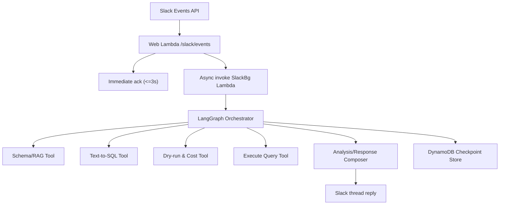

# LangGraph 기반 BigQuery 대화형 Slack Bot 명세

## 1. 문서 목적

이 문서는 현재 Data Bolt 저장소를 기준으로, 아래 요구사항을 충족하는 설계를 정의한다.

- DM/멘션 외 일반 채널 대화에서도 맥락상 필요하면 봇이 스레드를 시작해 응답
- BigQuery 스키마 조회 기반 Text-to-SQL
- 생성 SQL의 dry-run 검증 및 예상 비용 안내
- 필요 시 실제 쿼리 실행
- 생성 SQL/조회 결과를 바탕으로 후속 분석 대화 지속

구현 코드는 포함하지 않는다.

## 2. 현재 기준선 (As-Is)

- Slack 웹훅 수신/ack: `/slack/events` (`src/data_bolt/slack/handlers.py`)
- 장기 작업 위임: Web Lambda -> SlackBg Lambda async invoke (`src/data_bolt/slack/handlers.py`)
- 백그라운드 처리: `/slack/background` (`src/data_bolt/slack/background.py`)
- BigQuery SQL 생성/검증 로직: `src/data_bolt/tasks/bigquery_sql.py`
- 인프라: 단일 이미지 + Lambda 2개 (`template.yaml`)

현재 제약:

- `app_mention`만 BigQuery 백그라운드 처리에 연결됨
- `message` 이벤트는 DM만 처리
- 스레드 히스토리 기반 멀티턴 상태 저장 없음
- 쿼리 실행 단계(실제 run) 표준 인터페이스 없음

## 3. 목표 동작 (To-Be)

1. 이벤트 진입
- DM, 멘션, 일반 채널 메시지를 수신한다.
- Slack 3초 제한 내 `ack` 후 비동기 처리한다.

2. 맥락 기반 응답
- 멘션이 없어도 "응답 필요"로 분류되면 해당 메시지에서 스레드 시작 후 응답한다.
- 채널 소음 방지를 위해 채널 자동응답은 기본적으로 스레드만 사용한다.

3. BigQuery 작업
- 스키마 조회 -> SQL 생성 -> dry-run 검증/예상 비용 -> 실행(옵션) 흐름 지원
- 후속 질의에서 직전 SQL/결과를 재사용하여 분석 대화 지속

## 4. 아키텍처

## 5. LangGraph 도입 범위

LangGraph는 아래 책임만 담당한다.

- 멀티턴 상태 저장/복원
- 의도 라우팅
- 노드 단위 도구 호출 오케스트레이션
- 실행 전 승인 인터럽트(필요 시)

Slack SDK 호출, Lambda invoke, HTTP 입출력은 기존 런타임 어댑터(`slack/handlers.py`, `slack/background.py`)에서 담당한다.

## 6. 상태 모델

상태 키:

- `thread_id`: `{team_id}:{channel_id}:{thread_ts}`
- `run_id`: LangGraph 실행 단위 식별자

최소 상태 필드:

- `conversation`: 최근 대화 메시지 목록
- `intent`: `chat | schema_lookup | text_to_sql | validate_sql | execute_sql | analysis_followup`
- `question`: 현재 사용자 요청
- `schema_context`: 참조 스키마/용어집 텍스트 또는 참조 ID
- `candidate_sql`: 생성된 SQL
- `dry_run`: `{ok, error, bytes_processed, estimated_cost_usd}`
- `execution`: `{approved, job_id, row_count, preview_rows, error}`
- `artifacts`: 최근 SQL/결과 요약 이력
- `response`: Slack 전송용 최종 텍스트/블록

## 7. 그래프 노드 명세

1. `ingest_event`
- 입력 이벤트 정규화
- 채널/유저/스레드/메시지 메타 추출
- 봇 메시지 및 subtype 필터링

2. `classify_relevance`
- 일반 채널 메시지에 대해 "봇이 응답해야 하는지" 판별
- 결과: `ignore | ask_clarification | proceed`

3. `classify_intent`
- 분석/스키마조회/SQL생성/검증/실행/후속질의 의도 분류

4. `load_context`
- thread 상태와 이전 SQL/실행 결과 로드
- 필요 시 스키마/용어집 조회

5. `generate_sql`
- Text-to-SQL 생성
- 출력: 구조화(`sql`, `explanation`, `assumptions`)

6. `validate_sql_dry_run`
- dry-run 수행
- `bytes_processed` 기반 비용 추정값 계산

7. `policy_gate`
- 허용 정책 검사
- 예: 최대 바이트, 허용 dataset/project, 금지 구문(DDL/DML)

8. `request_execution_approval` (선택)
- 실행 필요 시 승인 요구
- 승인 정책에 따라 자동 패스 가능

9. `execute_sql`
- 쿼리 실행
- 결과 샘플/요약 생성

10. `compose_response`
- 현재 단계 결과를 자연어로 구성
- Slack thread 응답 포맷 생성

11. `persist_state`
- 상태/아티팩트 저장

## 8. 라우팅 정책

기본 정책:

- `DM`: 항상 `proceed`
- `app_mention`: 항상 `proceed`
- `channel/group/mpim message`: `classify_relevance` 결과에 따름

`classify_relevance` 권장 기준:

- 키워드: `bigquery`, `bq`, `sql`, `쿼리`, `빅쿼리`, `테이블`, `스키마`, `데이터`
- SQL 패턴 또는 비용/검증/실행 의도 표현
- 스레드 내 기존 봇 컨텍스트 존재 여부
- 신뢰도 낮으면 즉시 실행 대신 확인 질문 1회

## 9. BigQuery 작업 정책

1. 생성
- 기본은 `SELECT` 중심 쿼리
- 스키마에 없는 컬럼 추측 금지

2. 검증
- 실행 전 dry-run 기본 수행
- 오류 메시지 있으면 1차 자동 보정 시도 후 재검증

3. 비용
- `bytes_processed` -> 예상 비용 계산
- 사용자 응답에 "추정치"임을 명시

4. 실행
- 실행 정책:
- `AUTO_EXECUTE=false` 기본
- 승인 필요 조건: 바이트 임계치 초과, 정책상 고위험 쿼리, 데이터 민감도

## 10. DynamoDB 저장소 명세

권장 리소스:

1. 체크포인트 테이블
- 용도: LangGraph thread 상태 저장
- PK: `thread_id`
- SK: `checkpoint_ts` 또는 `run_id`
- TTL: 기본 30일

2. 이벤트 중복 방지 테이블
- 용도: Slack `event_id` dedupe
- PK: `event_id`
- TTL: 24시간

3. 실행 이력 테이블 (선택)
- 용도: SQL 실행 감사/추적
- PK: `thread_id`
- SK: `executed_at`

참고:

- 상태 크기가 커질 경우 결과 원문은 S3 저장 후 DynamoDB에는 참조만 저장한다.

## 11. 환경 변수 명세

새 변수는 `.env`에 `LAMBDA_` prefix로 선언 후 `just sync-env`로 동기화한다.

필수 후보:

- `LAMBDA_SLACK_CHANNEL_AUTO_REPLY` (`true|false`)
- `LAMBDA_SLACK_AUTO_REPLY_ALLOWLIST` (채널 ID CSV)
- `LAMBDA_SLACK_AUTO_REPLY_KEYWORDS` (CSV)
- `LAMBDA_LANGGRAPH_CHECKPOINT_BACKEND` (`dynamodb|postgres|memory`)
- `LAMBDA_LANGGRAPH_CHECKPOINT_TABLE`
- `LAMBDA_LANGGRAPH_REGION`
- `LAMBDA_BQ_AUTO_EXECUTE` (`true|false`, 기본 `false`)
- `LAMBDA_BQ_MAX_BYTES_BILLED`
- `LAMBDA_BQ_REQUIRE_APPROVAL_ABOVE_BYTES`
- `LAMBDA_BQ_RESULT_PREVIEW_ROWS`

## 12. 런타임 경계 (중요)

AGENTS 원칙 준수:

- `src/data_bolt/tasks/`: 순수 동기 비즈니스 로직만 유지
- Slack/Lambda I/O: `src/data_bolt/slack/` 어댑터에서 처리
- `boto3`, `slack_sdk` 호출은 `anyio.to_thread.run_sync`로 오프로딩

즉, LangGraph 그래프 실행 진입은 `slack/background.py`에서 수행하고, 순수 작업 함수는 `tasks/`로 분리한다.

## 13. 응답 포맷 표준

스레드 응답은 다음 순서를 권장한다.

1. 요청 해석 요약 1-2문장
2. SQL 코드 블록
3. dry-run 결과
- `ok/fail`
- `bytes_processed`
- `estimated_cost_usd`
4. 실행 결과(실행 시)
- `job_id`
- `row_count`
- `preview`
5. 후속 제안 질문 1개

## 14. 관측성/운영

로그 키 표준:

- `thread_id`
- `event_id`
- `intent`
- `node_name`
- `duration_ms`
- `dry_run_bytes`
- `estimated_cost_usd`
- `job_id`
- `error_type`

메트릭 권장:

- relevance hit rate
- dry-run success rate
- auto-fix success rate
- execution approval rate
- p95 end-to-end latency

## 15. 테스트 명세

1. 단위 테스트
- 의도 분류
- relevance 분류
- 비용 계산 로직
- 정책 게이트(허용/차단)

2. 통합 테스트
- Slack 이벤트 -> BG invoke payload 검증
- LangGraph 노드 전이
- dry-run 실패/보정/재시도

3. 회귀 테스트
- 후속 질의에서 이전 SQL/결과 참조 검증
- 중복 이벤트 수신 시 idempotency 보장

## 16. 점진 도입 계획

1단계:
- 현재 BigQuery 생성 흐름 유지 + relevance 분류 + 스레드 자동응답 도입

2단계:
- LangGraph 상태 저장 + 멀티턴 follow-up 도입

3단계:
- 실행 승인(HITL), 비용/정책 게이트 강화

4단계:
- 결과 아티팩트 장기 저장(S3), 관측성/평가셋 고도화

## 17. 오픈 이슈

아래 항목은 구현 전에 결정 필요:

1. 자동응답 허용 채널 범위(allowlist)
2. 실행 승인 정책(항상/조건부/자동)
3. 상태 보존 기간(TTL)
4. 민감 데이터 마스킹 기준
5. BigQuery 실행 권한 범위(프로젝트/데이터셋 제한)
